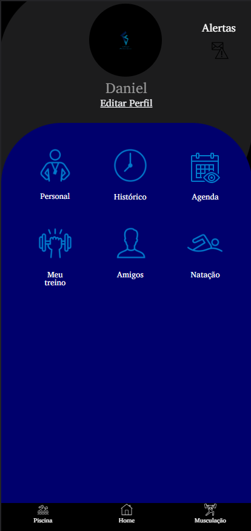
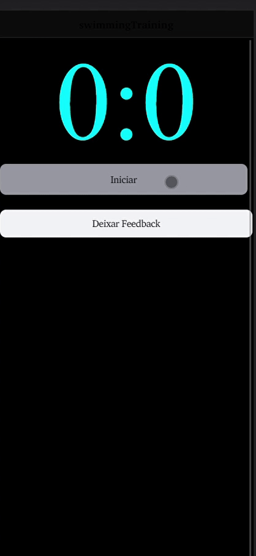
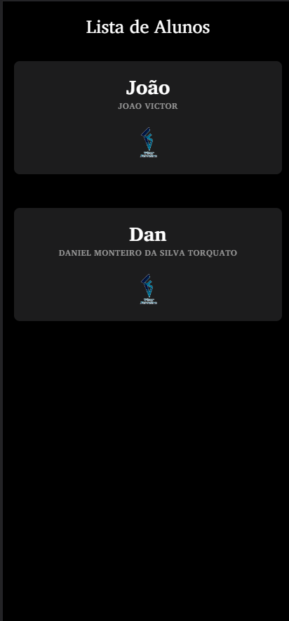

<h1 align="center">Vitor Ferreira Personal APP</h1>

Idealizado pelo Personal Vitor Ferreira, fui designado a desenvolver um app para facilitar o dia dia de alunos e professores, o projeto contará com funções para musculação e natação, sendo elas:

<ul>
<li>Agendamento de aulas</li>
<li>Treinos de Musculação</li>
<li>Gráficos detalhados</li>
<li>Gerenciamento de agenda</li>
<li>Treinos para piscina</li>
<li>Histórico de treinos</li>
<li>Entre outros...</li>
</ul>

<h2 align="center"> Cronômetro e histórico de tempo </h2>

Se desafie todos os dias e bata seu melhor tempo, o cronômetro conta com funções para marcar as voltas da piscina, zerar seu tempo caso não necessite daquela marcação e ao encerrar seu ciclo de treino, poderá ver o melhor tempo do dia, e se bateu seu recorde de tempo geral.

<h2 align="center"> Gerenciamento de Alunos </h2>

Você Personal pode controlar e montar o treino dos alunos, à partir de sua lista de alunos, controle, veja quem são seus alunos, para melhor gerenciá-los.

